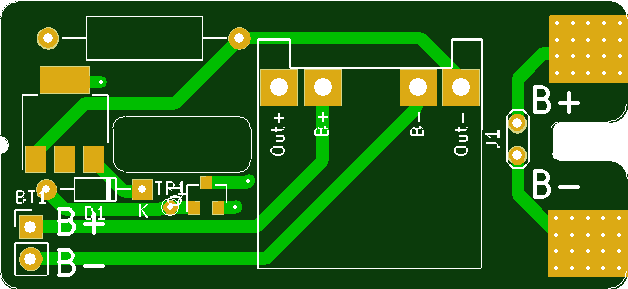
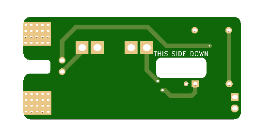

# READ ME AGB_LIPO from makhowastaken

LiPo adapter for Game Boy Advance.

* Uses these battery terminals: https://www.aliexpress.com/item/32946601230.html
* a standard TP4056 module (Micro USB or USB C): https://www.aliexpress.com/item/32649780468.html
* and pretty much whatever diode you can get your hands on: https://www.aliexpress.com/item/32664545131.html

I got my boards in and had to make some alterations to get them to fit better. I'm still waiting on the terminals so I'll add a youtube video for instruction when I get everything in. 
## Front:

* U1 - TP4056
* U2 - AMS1117-3.3
* Q1 - Si2301DS
* R1 - 100K
* R2 - 100
* D1 - 1N4001
* C1 - 22u TANTALUM
* C2 - 10u TANTALUM

* Solder TP1 to VIN+ of TP4056
## Back:

# MY Changes

* Load Shareing circuit (using SI2301DS and 1N4001 and 100k Resistor).
* Voltage Regulating (using AMS1117-3.3).
* NO MORE DIODE LIMITING.

# TO FIX
* GBA Low Battery Light.

# CHANGELOG
## >28.04.2020
* Base concept.

## 28.04.2020
* Added 3.3V Regulator.

## 29.04.2020
* Fixed Regulator capacitors
