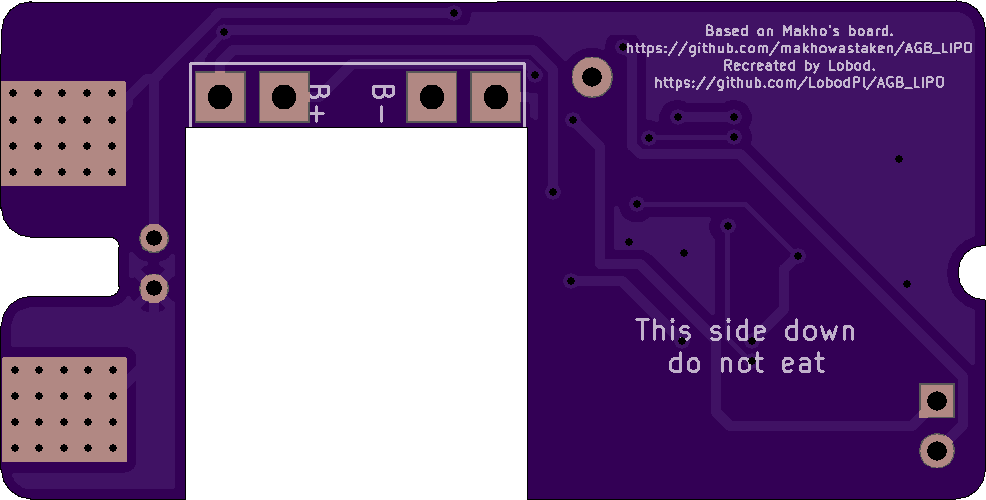

# README AGB_LIPO from makhowastaken

LiPo adapter for Game Boy Advance.

* Uses these battery terminals: https://www.aliexpress.com/item/32946601230.html
* a standard TP4056 module (Micro USB or USB C): https://www.aliexpress.com/item/32649780468.html
* and pretty much whatever diode you can get your hands on: https://www.aliexpress.com/item/32664545131.html

I got my boards in and had to make some alterations to get them to fit better. I'm still waiting on the terminals so I'll add a youtube video for instruction when I get everything in.
# My Project README

## Order at OSHPARK: https://oshpark.com/shared_projects/AJPIjHIz

## Front:

* Solder TP1 to VIN+ of TP4056
## Back:

# Symbols
* U1 - TP4056(Have to be soldered UpsideDown)
* U2 - TPS3700DDCR (Texas Intruments)
* IC1 - LP38693MP-ADJ (Texas Intruments)
* D1,D2 - SS14 Schottky Diode (or silmilar schottky diode)
* C1,C2,C3 - 10u CERAMIC(0603)
* C4 - 220u TANTALUM(KEMET-B)
* R1 - 470K(0603)
* R2 - 62K(0805)
* R3 - 1M(0603)
* R4,R5 - 240K(0805)

# My Changes

* Load Sharing.
* Voltage Regulation to 3.2V.
* GBA Low Battery Light trigered at LiPo 3,4V.

# CHANGELOG
## >28.04.2020
* Base concept.

## 28.04.2020
* Added 3.3V Regulator.

## 29.04.2020
* Fixed Regulator capacitors.

## 01.05.2020
* Full circuit redesign.

## 01.06.2020
* One more time full circuit redesign.
